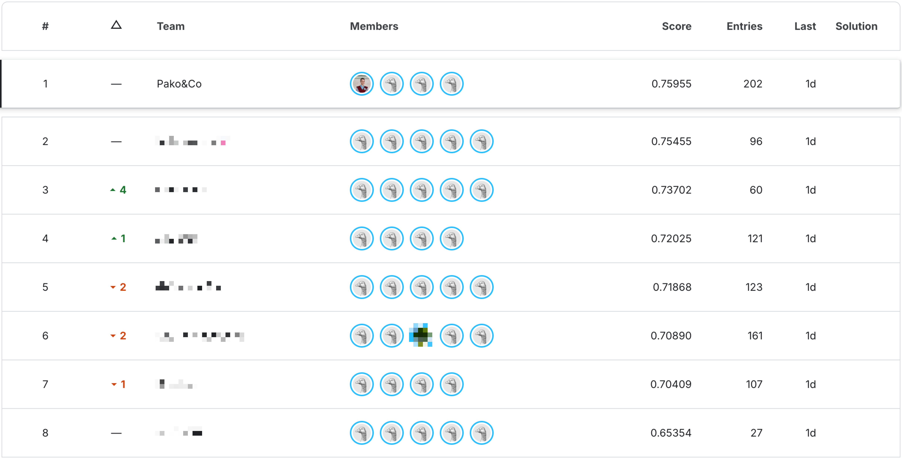

# 🧠 Competición de Aprendizaje Automático — APAU 3º

> 🥇 **Proyecto ganador de la competición de APAU**

Este repositorio contiene los notebooks desarrollados durante la competición de aprendizaje automático de la asignatura APAU (Aprendizaje Automático) del 3º curso del grado.  

---
Salgo
## 📂 Contenido del repositorio

Cada notebook incluye el proceso completo: limpieza, exploración, entrenamiento y predicción.

| Archivo | Descripción |
|----------|--------------|
| `tree.ipynb` | Árbol de decisión base. |
| `randomforest.ipynb` | Implementación de un Random Forest clásico. |
| `catboost.ipynb` | Modelo basado en CatBoost. |
| `svm.ipynb` | Clasificador basado en Support Vector Machines. |
| `stacking.ipynb` | Enfoque de stacking combinando varios modelos base. |

---

## 👥 Equipo — Pako&CO

- [Diego Besada](https://github.com/dbsada)  
- [Natalia Corchón](https://github.com/nataliacorchon)  
- [Alfonso Jimena](https://github.com/AlfonsoJimena)
- [Antonio Álvarez](https://github.com/Antonio2070)  

---

## 📊 Resultado de la competición

>🔗 [Enlace a la competición en Kaggle](https://www.kaggle.com/competitions/apau-loan-approval-prediction-in-pennsylvania)

---

## ⚙️ Tecnologías utilizadas

- Python 
- Jupyter Notebook 
- **Scikit-learn** 
- **CatBoost**
- Pandas
- NumPy 
- Matplotlib 
- Dtale

Además se probarón otras librerías y técnicas no presentadas en este repositorio.
